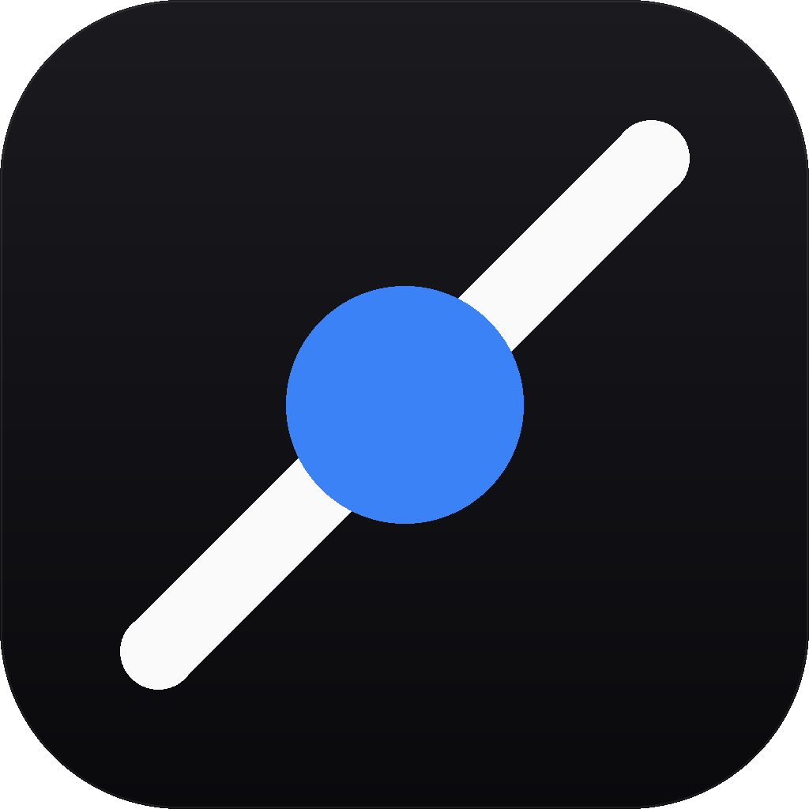

# AgentPack

<p align="center">
  
</p>

<p align="center">
  <strong>统一管理 AI 编码工具的 MCP / Skills / Agent 配置</strong>
</p>

<p align="center">
  <a href="./README_EN.md">English</a> | 简体中文
  · <a href="./CHANGELOG.md">更新日志</a>
  · <a href="./LICENSE">License: MIT</a>
</p>

---

## 简介

AgentPack 是一个基于 [Wails v3](https://v3.wails.io)（Go + Vue 3 + TypeScript）构建的跨平台桌面应用，
用于统一管理各类 AI 编码工具的 MCP 服务器、Skills 和 Agent 配置。

支持检测并管理以下 Agent：

| Agent | 变体 | 配置格式 |
| --- | --- | --- |
| Claude Code | CLI / Desktop | JSON |
| Codex (OpenAI) | CLI / Desktop | TOML |
| Cursor | IDE | JSON |
| OpenCode | CLI / Desktop | JSON |
| TraeCode | IDE | JSON |
| TraeCode CN | IDE | JSON |

> Desktop 变体仅在 Windows 上检测（通过注册表 / UWP 包检测）；CLI 变体通过 npm 全局包或 PATH 命令检测；IDE 变体通过注册表 / 应用目录检测。

## 功能特性

- **Agent 管理**：自动检测已安装的 AI 编码工具，支持启用/禁用单个 Agent
- **MCP 服务器管理**：增删改查 MCP 服务器，支持多 Agent 绑定与一键扫描
- **Skills 管理**：安装、卸载、更新检查，支持从 GitHub 仓库扫描与 ZIP 导入
- **市场浏览**：集成 Official Registry、skills.sh、GitHub 多个技能市场，支持无限滚动加载
- **配置导入/导出**：支持配置备份与在多设备间迁移
- **系统托盘**：Wails v3 原生托盘，支持语言切换时更新托盘文案
- **轻量模式**：托盘一键隐藏窗口并释放内存，支持空闲自动进入（可配置 1–120 分钟）
- **自动更新检查**：内置版本检查，对接 GitHub Releases，支持暂停/续传下载
- **中英双语**：内置中英文切换，默认跟随系统语言
- **跨平台**：支持 Windows、macOS（Intel / Apple Silicon）、Linux

## 技术栈

- **后端**：Go 1.25+、Wails v3
- **前端**：Vue 3、TypeScript、Vite、Tailwind CSS、shadcn/vue
- **数据库**：SQLite（modernc.org/sqlite 纯 Go 实现）
- **图标**：Phosphor Icons

## 环境要求

- [Go](https://go.dev/dl/) 1.25 或更高版本
- [Node.js](https://nodejs.org/) 20+
- [pnpm](https://pnpm.io/) 9+
- [Wails3 CLI](https://v3.wails.io/quick-start/installation)

**平台额外依赖：**

- **Windows**：需要 [WebView2 Runtime](https://developer.microsoft.com/microsoft-edge/webview2/)
- **macOS**：Xcode Command Line Tools
- **Linux**：`libgtk-3-dev libwebkit2gtk-4.1-dev pkg-config libfuse2`

## 快速开始

### 1. 克隆仓库

```bash
git clone https://github.com/sugu6/AgentPack.git
cd AgentPack
```

### 2. 安装依赖

```bash
# 安装 Wails3 CLI（若尚未安装）
go install github.com/wailsapp/wails/v3/cmd/wails3@latest

# 安装前端依赖
cd frontend && pnpm install && cd ..
```

### 3. 开发模式运行

```bash
wails3 dev
```

开发模式下会启动 Vite 开发服务器，提供前端热重载。
后端 dev server 运行在 `http://localhost:9245`，可在浏览器中调试 Go 方法。

### 4. 构建生产版本

```bash
# Windows 构建（生成 bin/AgentPack.exe）
wails3 task windows:build

# macOS 构建（生成 bin/AgentPack）
wails3 task darwin:build

# macOS Universal 构建（Intel + Apple Silicon 合并）
wails3 task darwin:build:universal

# Linux 构建（生成 bin/AgentPack）
wails3 task linux:build

# Windows 打包 NSIS 安装包（依赖 windows:build）
wails3 task windows:package

# macOS 打包（需在 macOS 上执行；依赖 darwin:build）
wails3 task darwin:package          # 生成 .app 应用包
wails3 task darwin:package:universal  # 用 Universal 二进制打包 .app

# Linux 打包（生成 AppImage / deb / rpm / Arch 包）
wails3 task linux:package
```

构建产物位于 `bin/` 目录下。

## 项目结构

```
AgentPack/
├── app.go                 # Wails 应用主入口，暴露给前端的方法
├── main.go                # 程序入口
├── tray.go                # 系统托盘实现
├── lite.go                # 轻量模式核心逻辑（空闲计时器、内存释放）
├── update.go              # 更新检查（GitHub Releases API）
├── winbridge.go           # Windows 主题桥接（Mica / 深色模式）
├── winbridge_stub.go      # 非 Windows 平台的空实现
├── devmode_dev.go         # 开发模式配置
├── devmode_prod.go        # 生产模式配置
├── Taskfile.yml           # Wails v3 构建任务定义
├── CHANGELOG.md           # 更新日志（中文）
├── CHANGELOG_EN.md        # 更新日志（英文）
├── internal/              # 后端业务逻辑
│   ├── agents/            # Agent 检测与管理
│   ├── backup/            # 备份与导入/导出
│   ├── config/            # 配置管理
│   ├── crypto/            # 环境变量加密
│   ├── database/          # SQLite 数据库
│   ├── dbutil/            # 数据库工具函数
│   ├── i18n/              # 国际化（zh-CN / en）
│   ├── iowriter/          # 原子写入
│   ├── logger/            # 日志工具
│   ├── market/            # 技能市场（Official / skills.sh / GitHub）
│   ├── mcp/               # MCP 服务器存储
│   ├── shared/            # 共享工具函数
│   ├── skills/            # Skills 管理与更新检查
│   └── win32/             # Windows 平台特定实现
├── frontend/              # Vue 3 前端
│   ├── src/
│   │   ├── views/         # 页面（Agents / MCP / Skills / Market / Settings）
│   │   ├── components/    # UI 组件
│   │   ├── stores/        # Pinia 状态管理
│   │   ├── lib/api.ts     # Wails 绑定封装
│   │   └── composables/   # 组合式函数
│   └── bindings/          # Wails v3 自动生成的绑定
├── build/                 # 各平台构建资源（v3 Taskfile 结构）
│   ├── config.yml         # Wails v3 构建配置
│   ├── windows/           # Windows 安装包资源
│   ├── darwin/            # macOS 构建资源（.app 打包 + DMG 素材）
│   └── linux/             # Linux 构建资源
└── scripts/               # 构建与发布脚本
```

## 下载安装

前往 [Releases 页面](https://github.com/sugu6/AgentPack/releases) 下载对应平台的安装包：

**Windows**
- `AgentPack-{version}-windows-amd64.zip` — 便携版
- `AgentPack-{version}-windows-amd64-installer.exe` — NSIS 安装包
- `AgentPack-{version}-windows-arm64.zip` — ARM64 便携版
- `AgentPack-{version}-windows-arm64-installer.exe` — ARM64 NSIS 安装包

**macOS**
- `AgentPack-{version}-macos-universal.dmg` — Universal（Intel + Apple Silicon）
- `AgentPack-{version}-macos-universal.zip` — 便携版

**Linux**
- `AgentPack-{version}-linux-amd64.tar.gz` — 便携版
- `AgentPack-{version}-linux-amd64.AppImage` — AppImage
- `AgentPack-{version}-linux-arm64.tar.gz` — ARM64 便携版
- `AgentPack-{version}-linux-arm64.AppImage` — ARM64 AppImage

> macOS 用户首次打开若提示无法验证开发者，请在「系统设置 → 隐私与安全性」中点击「仍要打开」。

## 开源许可

本项目基于 [MIT License](./LICENSE) 开源。

Copyright © 2026 sugu6