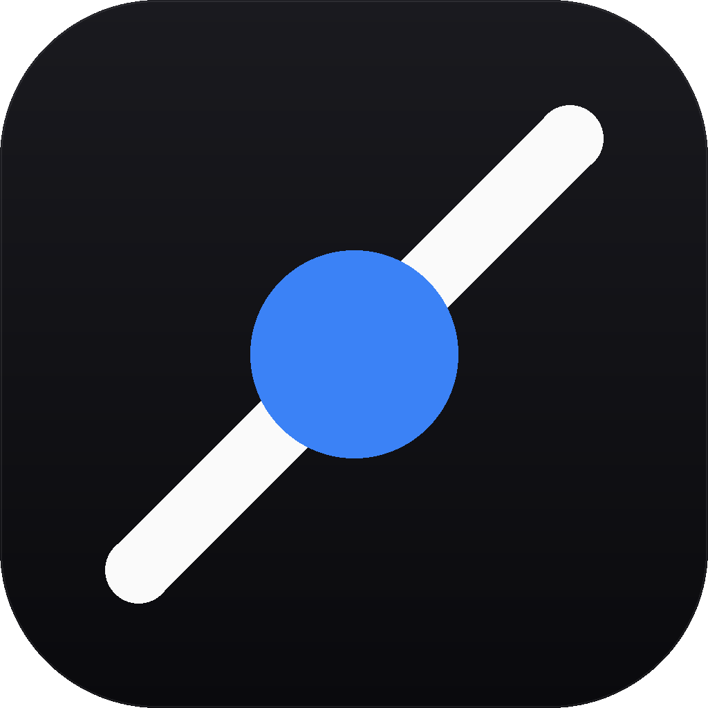

# AgentPack

<p align="center">
  
</p>

<p align="center">
  <strong>Unified management of MCP / Skills / Agent configurations for AI coding tools</strong>
</p>

<p align="center">
  English | <a href="./README.md">简体中文</a>
  · <a href="./CHANGELOG_EN.md">Changelog</a>
  · <a href="./LICENSE">License: MIT</a>
</p>

---

## Introduction

AgentPack is a cross-platform desktop application built with [Wails v2](https://wails.io)
(Go + Vue 3 + TypeScript) for unified management of MCP servers, Skills, and Agent
configurations across various AI coding tools.

Supported agents:

| Agent | Type | Config Format |
| --- | --- | --- |
| Claude Code | CLI | JSON |
| Codex | CLI | TOML |
| Cursor | IDE | JSON |
| OpenCode | CLI / Desktop | JSON |
| Trae | IDE / CN | JSON |

## Features

- **Agent Management**: Auto-detect installed AI coding tools; enable/disable individual agents
- **MCP Server Management**: Full CRUD for MCP servers with multi-agent binding and one-click scan
- **Skills Management**: Install, uninstall, check updates; scan from GitHub repos and import from ZIP
- **Marketplace**: Integrated Smithery, Official Registry, skills.sh skill marketplaces
- **Config Import/Export**: Backup configurations and migrate across devices
- **System Tray**: Lightweight mode; pause background scans when window hidden to tray
- **Auto Update Check**: Built-in version check via GitHub Releases with changelog preview
- **Cross-Platform**: Windows, macOS (Intel / Apple Silicon), Linux

## Tech Stack

- **Backend**: Go 1.25+, Wails v2.12
- **Frontend**: Vue 3, TypeScript, Vite, Tailwind CSS, shadcn/vue
- **Database**: SQLite (modernc.org/sqlite, pure Go)
- **Icons**: Phosphor Icons

## Requirements

- [Go](https://go.dev/dl/) 1.25 or higher
- [Node.js](https://nodejs.org/) 20+
- [pnpm](https://pnpm.io/) 9+
- [Wails CLI](https://wails.io/docs/gettingstarted/installation) v2.12.0

**Platform-specific:**

- **Windows**: [WebView2 Runtime](https://developer.microsoft.com/microsoft-edge/webview2/)
- **macOS**: Xcode Command Line Tools
- **Linux**: `libgtk-3-dev libwebkit2gtk-4.1-dev pkg-config libfuse2`

## Quick Start

### 1. Clone the repository

```bash
git clone https://github.com/sugu6/AgentPack.git
cd AgentPack
```

### 2. Install dependencies

```bash
# Install Wails CLI (if not yet installed)
go install github.com/wailsapp/wails/v2/cmd/wails@v2.12.0

# Install frontend dependencies
cd frontend && pnpm install && cd ..
```

### 3. Run in development mode

```bash
wails dev
```

Development mode starts the Vite dev server with frontend hot-reload.
The backend dev server runs at `http://localhost:34115` for browser-based Go method debugging.

### 4. Build for production

```bash
wails build -clean
```

Build artifacts are located in `build/bin/`.

## Project Structure

```
AgentPack/
├── app.go                 # Wails app entry, methods exposed to frontend
├── main.go                # Program entry
├── tray.go                # System tray implementation
├── update.go              # Update check (GitHub Releases API)
├── wails.json             # Wails project config
├── CHANGELOG.md           # Changelog (Chinese)
├── CHANGELOG_EN.md        # Changelog (English)
├── internal/              # Backend business logic
│   ├── agents/            # Agent detection and management
│   ├── backup/            # Backup and import/export
│   ├── config/            # Configuration management
│   ├── crypto/            # Environment variable encryption
│   ├── database/          # SQLite database
│   ├── i18n/              # Internationalization (zh-CN / en)
│   ├── market/            # Skill marketplace (Smithery / Official / skills.sh)
│   ├── mcp/               # MCP server storage
│   └── skills/            # Skills management and update check
├── frontend/              # Vue 3 frontend
│   ├── src/
│   │   ├── views/         # Pages (Agents / MCP / Skills / Market / Settings)
│   │   ├── components/    # UI components
│   │   ├── stores/        # Pinia state management
│   │   ├── lib/api.ts     # Wails binding wrapper
│   │   └── composables/   # Composition functions
│   └── wailsjs/           # Wails auto-generated bindings
└── build/                 # Build resources per platform
```

## Download & Install

Visit the [Releases page](https://github.com/sugu6/AgentPack/releases) to download the installer for your platform:

- **Windows**: `AgentPack-windows-amd64.zip`
- **macOS (Intel)**: `AgentPack-macos-intel.dmg`
- **macOS (Apple Silicon)**: `AgentPack-macos-arm64.dmg`
- **Linux**: `AgentPack-linux-amd64.tar.gz` or `AppImage`

> macOS users: if you see an "unverified developer" warning on first launch, go to
> "System Settings → Privacy & Security" and click "Open Anyway".

## License

This project is open-sourced under the [MIT License](./LICENSE).

Copyright © 2026 sugu6
